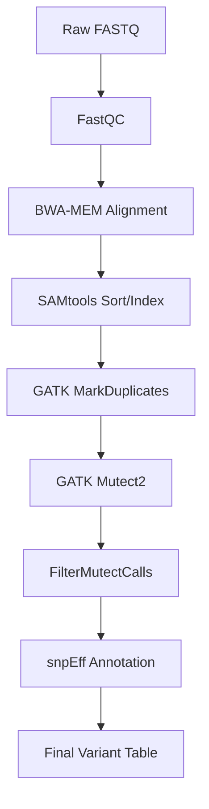
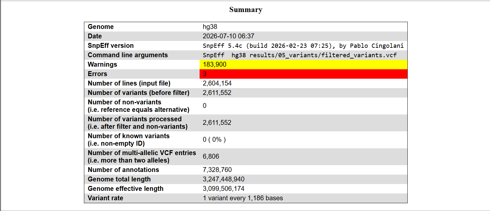
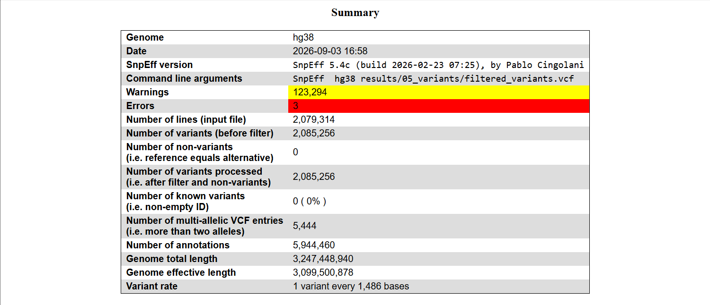
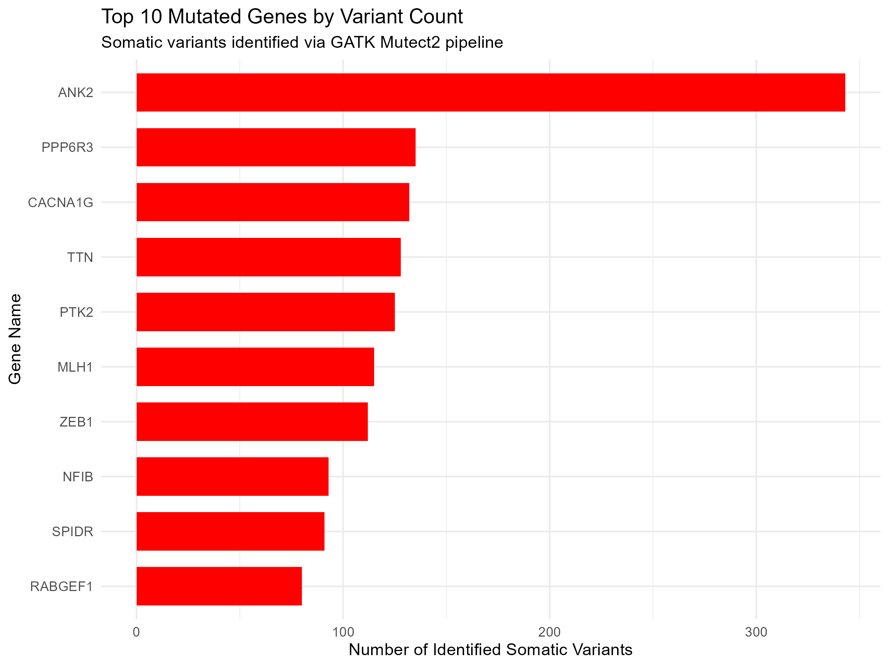
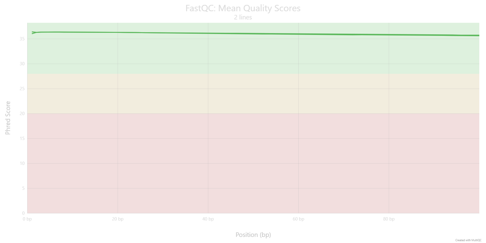
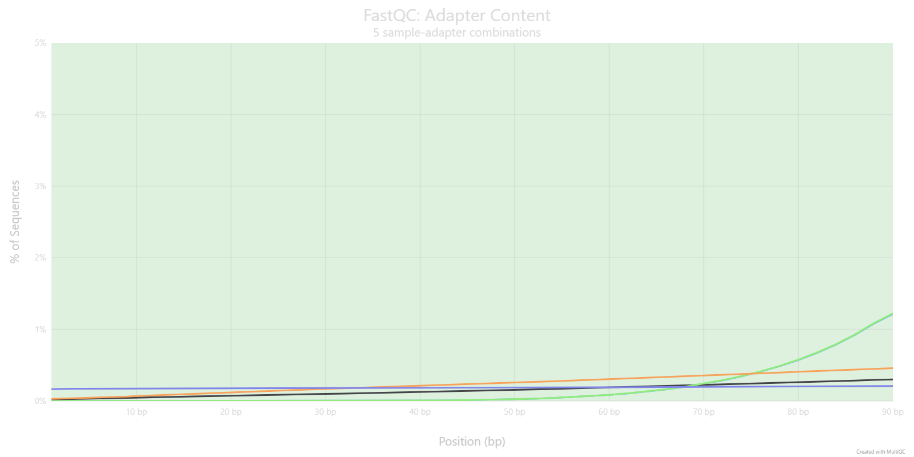

# Somatic Variant Calling Pipeline - Breast Tumor NGS Analysis

An end-to-end GATK4 Best Practices somatic variant discovery pipeline, built and run on real human breast tumor whole-exome sequencing sample. This project takes raw FASTQ reads through alignment,quality check, duplicate marking, tumor-only somatic variant calling, statistical filtering, and functional annotation  with each design decision documented and validated against known biological and technical expectations.

## Sample
|||
|---|---|
| Accession	| [SRR39421274](https://www.ncbi.nlm.nih.gov/sra/SRR39421274) (Illumina NovaSeq 6000) |
| Source	    | 	Adult female breast tumor, FFPE tissue |
| Study	| HER2-positive breast cancer |
| Reads	    | ~61.5M paired-end reads (~12.4 Gb bases) |
| Design	    | Tumor-only (no matched normal available) |
| Reference	| GRCh38 (hg38), UCSC analysis set build |

## Pipeline Structure 

## Tools that I used and why 
 
 ### Reference genome 
  UCSC [hg38](https://hgdownload.gi.ucsc.edu/goldenPath/hg38/bigZips/analysisSet/) analysis set, not the standard hg38.fa Hard-masks the pseudo-autosomal regions (PAR) on chromosome Y, strips redundant alternative haplotype (ALT) contigs, and includes an EBV decoy sequence  preventing multi-mapping ambiguity and false-positive viral-contamination calls that the plain hg38 build would introduce.

 ### BWA-MEM for alignment
  Industry standard for short-read Illumina alignment; the aligner GATK's Best Practices workflow is built around. Read groups (-R, with ID/SM/PL) are injected directly during alignment rather than as a separate post-processing step, avoiding an unnecessary extra read/write pass over a multi-GB file.

 ### GATK MarkDuplicates
  flagging (not removing) duplicates --REMOVE_DUPLICATES false Mutect2 uses duplicate information in its statistical noise model, so duplicates are flagged, not deleted. The deprecated samtools rmdup was avoided for the same reason. 

 ### Mutect2 (tumor-only mode) 
  Mutect2 Over HaplotypeCaller HaplotypeCaller assumes a diploid germline genome with variants at fixed 50%/100% allele frequencies. Tumor tissue is a heterogeneous mixture of cancer subclones and normal cells true driver mutations can appear at low, variable frequencies that HaplotypeCaller would misclassify as noise. Mutect2's somatic model is built to detect these. Tumor-only mode was used because no matched normal tissue was available for this public sample. 

 ### --germline-resource (gnomAD) + --panel-of-normals (1000 Genomes PoN)
  Tumor-only calling's core weakness: with no matched normal to subtract, there's no direct way to distinguish a real tumor-acquired mutation from a common inherited variant, or from a recurring platform-specific sequencing artifact. These two resources close both gaps independently  gnomAD addresses population-level germline variation, PoN addresses technical/sequencing-platform noise. See Results below for the measured impact.

 ### snpEff + SnpSift
  For annotation snpEff loads the hg38 transcript database into memory and classifies each variant's functional consequence by codon-level translation against every overlapping transcript. SnpSift filters to statistically trustworthy (PASS) + functionally severe (HIGH/MODERATE) variants, then flattens the nested ANN= annotation into a clean, tidy table using extractFields -s "," -e "."  comma-joining multi-transcript values within a single cell (rather than spilling into ragged extra columns) so every row has a consistent, fixed column count.

## Results

### 1. Germline/PoN filtering measured impact  

|  | Without germline-resource / PoN | With germline-resource + PoN |
|---|---|---|
| Total annotated variants | 2,611,552 | 2,085,256 (~20% reduction) |
| High-impact (PASS, HIGH/MODERATE) variants | 16,691 | 6,982 (~58% reduction) |
| Ts/Tv ratio | 2.0177 | 1.9973 | 

*(Source: snpEff summary reports, shown below)*

### without germline_resource / PoN

### with germline_resource / PoN

The Ts/Tv ratio staying essentially unchanged (2.02 - 2.00) while ~20% of variants were removed confirms the filtered-out variants were disproportionately non-biological noise (common germline polymorphisms, platform artifacts) rather than real signal  if the filtering had been too aggressive, the ratio would have dropped noticeably.

### 2. A caught artifact - chromosome Y calls in a female sample

The initial call set included variants on chrY (UTY, KDM5D) despite the sample being from a female donor. Investigation showed these genes have highly homologous (~85-90% identical, not masked-PAR-identical) paralogs on the X chromosome (KDM6A, KDM5C)  similar enough that reads from the true X-chromosome copy were occasionally mismapped to the Y paralog by BWA-MEM. Both flagged variants also carried known dbSNP IDs, consistent with them being previously catalogued common variants rather than novel tumor mutations. These were excluded from the final table and used as a sample-sex-verification sanity check.

### 3. Driver gene analysis

 Raw mutation frequency alone is not a reliable way to identify cancer driver genes - larger genes (e.g. TTN, the largest gene in the human genome, and ANK2) accumulate more mutations simply through greater genomic size, independent of biological significance (see Visualizations below). To identify plausible driver events, variants were instead filtered by functional severity (HIGH/MODERATE impact) and cross-referenced against a curated list of established breast cancer driver genes (TP53, BRCA1, BRCA2, PIK3CA, PTEN, ESR1, ERBB2, GATA3, CDH1, MAP3K1):

 | Gene	| Position | 	Effect | Impact |	VAF |
 |---|---|---|---|---|
 | PIK3CA 	| chr3:179,219,964 |	missense_variant |	MODERATE	 | 0.068 |
 | MAP3K1 |	chr5:56,815,591 |	missense_variant |	MODERATE |	0.088 |
 | MAP3K1 |	chr5:56,882,711  |	missense_variant |	MODERATE |	0.040 |
 | BRCA2 |	chr13:32,336,864 |	missense_variant |	MODERATE |	0.130 |
 | BRCA2 |	chr13:32,379,833 |	missense_variant |	MODERATE |	0.115 |
 
 No HIGH-impact variants were found in any of the 10 driver genes; all five candidates above are MODERATE-impact missense variants. All show low variant allele frequency (0.04-0.13), suggesting these are subclonal events present in a minority of tumor cells rather than dominant, tumor-founding mutations.

**Note:** BRCA2 mutations can be inherited rather than tumor-caused. Without a matched normal sample to compare against, these two BRCA2 variants can't be fully confirmed as somatic (tumor-specific) versus germline (inherited).

## Visualizations

 ### Top 10 most frequently mutated genes by variant count
 **Note:** raw variant count is influenced by gene length (ANK2 and TTN are among the largest human genes)

 
 

## Tools Used

SRA Toolkit . FastQC . BWA-MEM . SAMtools . GATK4 (MarkDuplicates, Mutect2, FilterMutectCalls, CreateSequenceDictionary) . snpEff / SnpSift . R (tidyverse, ggplot2)

## Key Technical Notes

- Read trimming (fastp) was evaluated and deliberately skipped after FastQC confirmed high per-base quality (>Q30) with no adapter contamination.
  ### Per-base quality 
   

  ### Adapter contamination
   

- Raw FASTQ, reference genome, and Mutect2 resource files (gnomAD, PoN) are not committed to this repository due to size 01_downloading_data.sh reproduces them from source.  